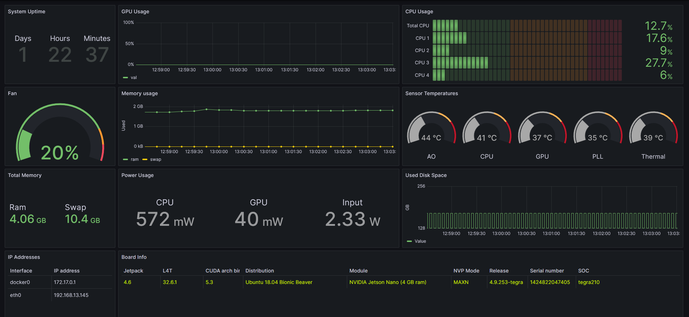

# jetson-stats-grafana-dashboard

## Introduction
This project is a Grafana dashboard, driven by a Prometheus metrics collector, for monitoring NVIDIA Jetson Nano operating autonomously in a headless fashion.




## Prerequisites

The following hardware and software should already be configured and operational:

- NVIDIA Jetson device
- A host running [Grafana](https://grafana.com/) 
- A host running [Prometheus](https://prometheus.io/)


## Installation

### Jetson Device

1. Install dependencies in 'requirments.txt' file

2. Next, install the collector with 'install.sh' bash script

	```bash
	nvidia@agx-desktop $ sudo bash install.sh
	```

**Note:** The Prometheus metrics collector listens on port `8000` by default. If you wish to change this you will need to edit the `jetson_stats_prometheus_collector.service` file and change the `--port` argument to your required port number.

### Prometheus Metrics Collection

1. Open the Prometheus config:

	```bash
	$ sudo nano /etc/prometheus/prometheus.yml
	```

2. Add metrics collection job config for the Jetson device

	```yml
	scrape_configs:
	  - job_name: 'nvidia_jetson'
	    static_configs:
	    - targets: ['JETSON_HOST_IP:JETSON_PROMETHEUS_COLLECTOR_PORT']
	```

3. Restart the Prometheus service for the changes to take effect

	```bash
	$ sudo systemctl restart /etc/systemd/system/prometheus.service
	```


### Grafana Dashboard Panel

1. From the Grafana Admin Dashboard select `+Create` -> `Import`

2. Open the file `jetson_stats_grafana_dashboard.json` and change the `__inputs` entry for the `DS_MY_PROMETHEUS` value to your prometheus name and save the file

3. Next, copy and paste the contents of modified `jetson_stats_grafana_dashboard.json` into the text box named `Import via panel json` or select the file using the `Upload JSON file` button

4. The `jetson-stats-grafana-dashboard` should now be available
